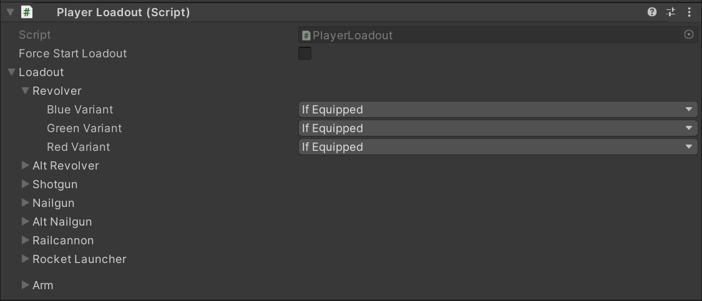
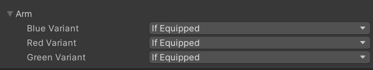

# Player Loadout
---

The `Player Loadout` component is used to modify the current weapons the player has access to.

## Behavior
This component is used to enable/disable which weapons the player is allowed to use during runtime, this is done by calling the [SetLoadout()](/Components/Player%20Loadout#setloadout) function.

?> **Tip!** The component's `Force Start Loadout` field can be used to force whatever loadout was chosen, as soon as the level is loaded.

### Force Start Loadout
Forces whatever loadout assigned, on start and eliminates the need for a gameobject with a trigger.
### PlayerLoadout.ForceLoadout

A class which contains multiple [VariantSettings](/Components/Player%20Loadout#forceloadoutvariantsetting) for all the weapons in the game. They are all listed below.

[VariantSetting](/Components/Player%20Loadout#forceloadoutvariantsetting) `revolver`

[VariantSetting](/Components/Player%20Loadout#forceloadoutvariantsetting) `altRevolver` *(slab revolver)*

[VariantSetting](/Components/Player%20Loadout#forceloadoutvariantsetting) `shotgun`

[VariantSetting](/Components/Player%20Loadout#forceloadoutvariantsetting) `nailgun`

[VariantSetting](/Components/Player%20Loadout#forceloadoutvariantsetting) `altNailgun` *(sawblade launcher)*

[VariantSetting](/Components/Player%20Loadout#forceloadoutvariantsetting) `railcannon`

[VariantSetting](/Components/Player%20Loadout#forceloadoutvariantsetting) `rocketLauncher`

[VariantSetting](/Components/Player%20Loadout#forceloadoutvariantsetting) `arm`

### ForceLoadout.VariantSetting
Contains the `Variant Option` enum. For simplicities sake, it is listed below.

*`public enum VariantOption {IfEquipped = 0, ForceOn = 1, ForceOff = 2}`*

`IfEquipped` - If this option is selected, the selected weapon variant will be allowed, but will not be force equipped.

`ForceOn` - If this option is selected, the selected weapon variant will be forced to be equipped.

`ForceOff` - If this option is selected, the selected weapon variant will be disallowed and will not be able to be equipped.

### SetLoadout()
When this function is called, it sets the player's current loadout to whatever parameters the script has assigned.

---

## Creating a Weapon Disable Zone
This tutorial will teach you how to create a zone which disables all of the player's weapons except the revolver. This tutorial can be easily adapted to trigger whatever weapons your level needs!

### Configuring our Player Loadout Object

Create a empty gameobject and add the `Player Loadout` component to it.

Set up the Player Loadout however you like, but in this tutorial we will set everything to `Force Off`, except everything in the arms category which we will set to `If Equipped`. 

We will also set the blue variant of the revolver to `Force On`.

### Setting up our Zone

Create a gameobject, the gamobject can have any model, but **must have a trigger collider**.

To this gameobject give it the [Object Activator](/Components/Object%20Activator.md) component.

?> **Tip!** You can set your Object Activator's `One Time` field to true, if you don't want the player to be triggering this multiple times! This is useful if you have a level in which multiple of these zones are used.

Add an event to the object activator in the `On Activate()` field, and in the blank slot that has appeared drag and reference the player loadout gameobject we created [here](/Components/Player%20Loadout#configuring-our-player-loadout-object). 

Set the function to `PlayerLoadout.SetLoadout()`, this will cause the `Player Loadout` script to set the player's loadout whenever the player triggers this zone.

---

*Originally Written by: greengrapes0*

*Adapted by: greengrapes0*
