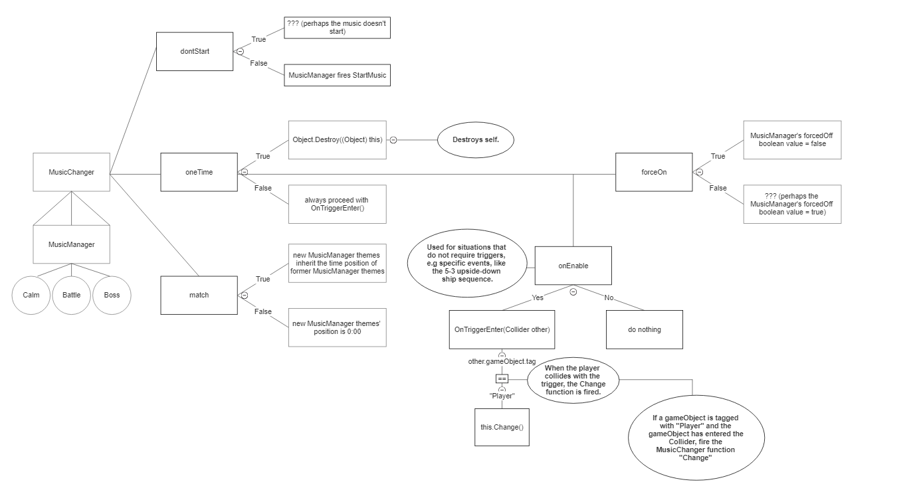

# Music Manager/Changer

## Intro

`MusicManager` is a GameObject required for playing music. It exists in every ULTRAKILL level.

`MusicManager` is a child of `StatsManager` (*a GameObject that handles player stats, such as ranks, secrets, the timer, checkpoints, etc*). 

`MusicManager` has three children; `CleanTheme`, `BattleTheme`, `BossTheme`. 

Each of these children have an [`AudioSource`](https://docs.unity3d.com/2019.4/Documentation/Manual/class-AudioSource.html) outputting an [`AudioClip`](https://docs.unity.cn/2019.4/Documentation/Manual/class-AudioClip.html) to [`MusicAudio`](https://docs.unity.cn/2019.4/Documentation/Manual/class-AudioMixer.html). 

## The Music Manager

`MusicManager` has multiple functions and variables:

### Fields

- **off** - is exactly what you think it is.
- **volume** -  is a variable. its floating point value is 1. later it is referred to as "MusicManager's volume"
- **filtering** - is a variable declared in Update() — it's a high pass filter
- **arenamode** - is a variable representing the state of the arena — if it has enemies, a boss?, or if it's clean.
- **allThemes** - is an array of the following themes:
    - `cleanTheme`
    - `battleTheme`
    - `bossTheme`
    - *`targetTheme`*
        - Before any music is played, `targetTheme` is set to `None`, this is because none of the themes are actually played. Instead, they are copied to `targetTheme` when needed.
    - These are the 3 (*excluding targetTheme*) AudioClips declared in `MusicManager`.

- **allTheme** - is the variable used in the array `allThemes`.
- **forcedOff** - is a variable used in functions such as `ArenaMusicStart()`, `ForceStartMusic()`, `ForceStopMusic()`, etc.
- **dontMatch** - is a variable used in functions such as `PlayBattleMusic()`,  `PlayCleanMusic()`, etc.
- **requestedThemes** - is the variable used to represent the amount of themes are required to be changed in the functions `PlayBattleMusic()`, `PlayCleanMusic()`, and `ArenaMusicEnd`.

---

### Functions

- `StartMusic()` - if the variable `forcedOff` is `true`, don't do anything. Start every declared theme at 0:00, turn the `off` variable to `false`, change cleanTheme's volume to the volume declared in `MusicManager`.

- `StopMusic()` - the variable `off` is set to `true` and using the allTheme array, the volume of each theme is set to 0, and then the `AudioSource(s)` are stopped.

- `ForceStartMusic()` - makes the variable `forcedOff` false, then fires `StartMusic()`.

- `ForceStopMusic()` - sets forcedOff to true, then fires StopMusic().

- `FilterMusic()` & `UnfilterMusic()` - when the game is paused, a [`high pass filter`](https://docs.unity3d.com/2019.4/Documentation/Manual/class-AudioHighPassFilter.html) is applied to the music. when the game is unpaused, the highpass effect is removed through `RemoveHighPass()`. 
    - To prevent overlap and the effect not being removed fast enough, the Invoke call for `RemoveHighPass()` is cancelled.

- `ArenaMusicStart()`
    - If `forcedOff` is `true`, don't do anything. 

    - If the variable `off` is set to `true`, start the music from `0` using `allTheme(s)`, set `off` to `false`, change the `battleTheme` volume to the `volume` variable, and set `targetTheme's` AudioClip to the `battleTheme's` AudioClip. 

    - If `battleTheme` isn't playing, start the music, and change the `battleTheme` volume to the `volume` variable. 

    - if the `targetTheme's` AudioClip is equal to `bossTheme's` AudioClip, set the arenaMode variable to `true`.

- `ArenaMusicEnd()`
    -  The `requestedThemes` amount is set to 0, the `targetTheme's` AudioClip is set to the `cleanTheme's` AudioClip, the `arenaMode` is set to `false`.
    
- `PlayBattleMusic()` - execute this **ONLY** if both are correct; `dontMatch` is `false`, and the `targetTheme` isn't equal to `battleTheme`.
    - Changes the `battleTheme` time to `cleanTheme`.

    - If the `targetTheme` isn't equal to the `bossTheme`, change `targetTheme` to `battleTheme`. then, increment `requestedThemes` by `1`.

- `PlayCleanMusic()`
    - Decrement `requestedThemes` by `1`.

    - If `requestedThemes` are over `0`, or `arenaMode` is over `0`, do nothing.

    - If `dontMatch` is `false`, **AND** `targetTheme` isn't equal to `cleanTheme`, set `cleanTheme's` time to be equal to `battleTheme's` time.

    - If the volume of `battleTheme` and `MusicManager` are equal, set `cleanTheme's` time to be equal to `battleTheme's` time.

- `PlayBossMusic()` 
    - If the `targetTheme` isn't equal to `bossTheme`, set `bossTheme's` time to `cleanTheme's` time.
    - Set the `targetTheme` to `bossTheme`.

---

### Unity Methods

- `OnEnable()` 
    - If `fadeSpeed` is `0`, set it to `1`.

    - The array `allThemes` is defined by getting all the components of type `AudioSource` in `MusicManager's` children. 

    - `defaultVolume` is set to the volume of `MusicManager`. 

    - If `off` is `false`, start the music through `allTheme`. if the condition is not met, get the `AudioSource` component of targetTheme. 

- `Update()`
    - If `off` is `false`, **AND** the `targetTheme` volume isn't equal to the `MusicManager` volume, do this for every `AudioSource` in `allThemes`.

    - If `allTheme` is `targetTheme`, and `allTheme` volume is over the volume of `targetTheme`, set `allTheme` volume to the the `MusicManager` volume. then, 

    - Starts updating the state of the music, (*moving the timescale, fadespeed, volume, etc*.). **If `off` is `true`, don't update**. 

    - If `filtering` is `true`, turn on a `high pass filter`.

    - If the volume of `MusicManager` isn't equal to `0`, **AND** `MusicManager's` variable `off` is `false`, **OR** `targetTheme` volume is less or equal to `0`, do nothing.

    - If the volume of `targetTheme` is above `0`, do nothing.

## The Music Changer
*This part of the documentation is a tutorial!*

This tutorial will teach you how to dynamically change the song in your level.

<video src="https://cdn.discordapp.com/attachments/1147476326043877439/1147476585058934875/musicchanger_guide.mp4" controls title="Music Changer Tutorial" width="800" height="450"></video>

Below is a flowchart displaying how the `MusicChanger` functions. Please keep in mind that is information might not be up to date!

---

*Guide Written by: yofenko*

*Adapted & Expanded by: LUKA*

