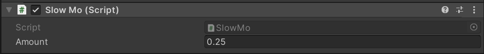
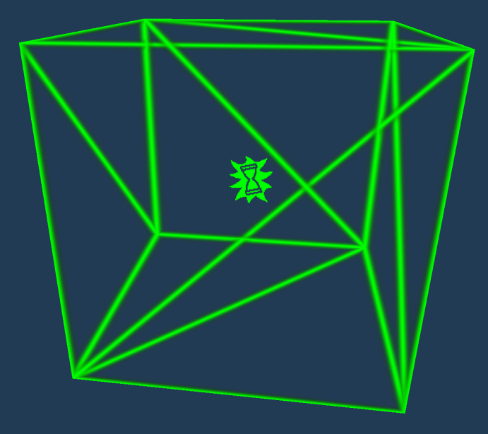

# Slow-Mo
---

The slow mo script behaves exactly like the name. It makes the game enter slow-motion, (or if selected it speeds up the game).

## Behavior

When the component becomes active (`OnEnable()`) it updates the game’s current timescale to whatever value you set in the inspector. 

A quick explanation on Unity’s [Timescale](https://docs.unity3d.com/2019.4/Documentation/ScriptReference/Time-timeScale.html "Unity Documentation")…

When the *Timescale* is equal to `1`, the game runs at **normal** speed. 

When the *Timescale* is equal to `0.5` the game runs at **half** speed. 

When the *Timescale* is equal to `2` the game runs at **double** the normal speed.

> [!WARNING]
> After the slow motion script overrides the game’s current speed, the game automatically smooths back to the normal run speed by itself. In short, you can’t have slow motion for an extended time without some hacky workarounds.

## Setting up a Slow-mo Zone

This tutorial will teach you how to create a gameobject with a trigger, which causes the game to go into slow motion when the player enters it.

### Creating our Slowmo Gameobject

Start by creating a new empty gameobject in your scene.

Then select it and click add component in the inspector window.

Select and add the `Slow Mo` component.

In the component settings, set the `Amount` field to what the Timescale should be set to.

In this tutorial setting the `Amount` field to 0.25 will make a nice and exciting slow motion effect.

Now that we created our slowmo gameobject we need to create a prefab using this gameobject.

In the Hierarchy click and drag the Slowmo gameobject into the **Project Window**.

### Creating our Slowmo Zone Gameobject

Now that we created the gameobject that changes the game’s speed, we need to create the zone that will trigger this speed change.

Create a new gameobject, or use a previously existing gameobject (**with a trigger collider**).

Add the [Object Spawner](/Components/Object%20Spawner.md) script to it.

Set “Spawnables” size to 1, and drag in the prefab we created.

Now add the [`Object Activator`](/Components/Object%20Activator.md) script to our slowmo zone gameobject.

> [!TIP]
> You can set the `One Time` field to true, if you want your slowmo to only trigger once. ㅤㅤㅤㅤㅤㅤㅤYou can set the `Delay field` to the amount of seconds you want to wait before our slowmo starts.

In the OnActivate() event box, hit the plus, that creates a new UnityEvent.

Drag our object activator script to our blank reference in the new UnityEvent we just created.

Click on the “No Function” box and select `ObjectSpawner.SpawnObject(int)`. Leave the function’s passing arguments as `0`.

> [!NOTE]
> What this does is it spawns item `zero` from our Object Spawner component which is our slowmo gameobject.

## Conclusion

Now on building our level and testing it, once the player enters the trigger of our Slowmo Zone gameobject the Slowmo object is spawned, and the game changes to your selected speed.

## Useful Resources

* [Object Activators (Tundra Docs)](<https://docs.tundra.pitr.dev/components/object-activator/>)
* [Time.Timescale (Unity Docs)](<https://docs.unity3d.com/2019.4/Documentation/ScriptReference/Time-timeScale.html>)
* [Slomo Prefabs Download Link](<https://drive.google.com/file/d/1kagX_GrjBOC9IRrJjYjl2iWJ-86ZMDK-/view?usp=sharing>)  (*Download `.zip` extract it and import it into your project!*)

> [!NOTE]
> *Green lines disappear on play.*

---

*Guide Written by: LUKA*
