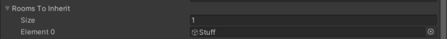

# FAQ

**Welcome to the Rude Level Editor FAQ.**

Please keep in mind that this page is always being updated!

## Frequently Asked Questions

### Help! Some of my objects turned pink! 👾
While this this can be caused by many things, what pink usually means is that the material you assigned to your gameobject has a missing texture.
This can be caused by:
- Deleting a texture asset a material uses
- Using textures from premade Ultrakill assets, instead of assigning a gameobject the material that texture corresponds too. 
- (Very Unlikely) Shaders used are not supported by the Unity's current render pipline, the [Built-In Render Pipeline](https://docs.unity3d.com/2019.4/Documentation/Manual/built-in-render-pipeline.html).

---

### MY CHECKPOINTS ARENT WORKING WHYYYYYYYYY!!! 😭😭😭😭
This also can be caused by many things, just make sure your checkpoints follow the rules below:
- **Checkpoints must not have a parent!**
- Remember the room you want to save the progress of should be referenced under `Rooms To Inherit`

- The room that should be activated on respawning at the checkpoint should be referenced under `To Activate`

---

### Why aren't my custom scripts working? 💾
Remember while developing for Ultrakill, you can't use all of Unity's functionalities including created scripts as usual.
Here are some things to watch out for:
- To create custom scripts for your level follow [this guide](/Tutorials/Advanced/Custom%20Scripting.md).
- If you modified your `.dll` in your Ultrakill's `Scripts` folder remember to restart the game.
- Make sure to import your `.dll` into your project's `RudeScripts` an no where else.
- Level may not contain a component provided by the script
- Exporter may be an older version. Try updating via [#updates](https://discord.com/channels/1121799211101458572/1124763099535261786)! 

---

### My Object/Arena Activator is not activating! 📲
[Object Activators](/Components/Object%20Activator.md) either activate `OnEnable()` if the gameobject they are assigned to has **no trigger**, or `OnTriggerEnter()` if the gameobject does have a **valid trigger**.

[Activate Arenas](/Components/Activate%20Arena.md) only activate `OnTriggerEnter()` unless specified otherwise. Which means the gameobject it is assigned to **must have a trigger**!

---

### How do I get access to the Rude Level Editor??

[here](https://www.youtube.com/watch?v=dQw4w9WgXcQ&ab_channel=RickAstley "Rude Download (Official)") :expressionless:

---
*Page Written by: LUKA*
