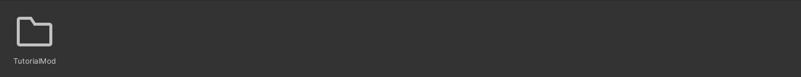
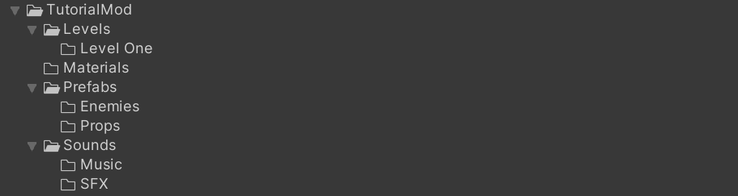
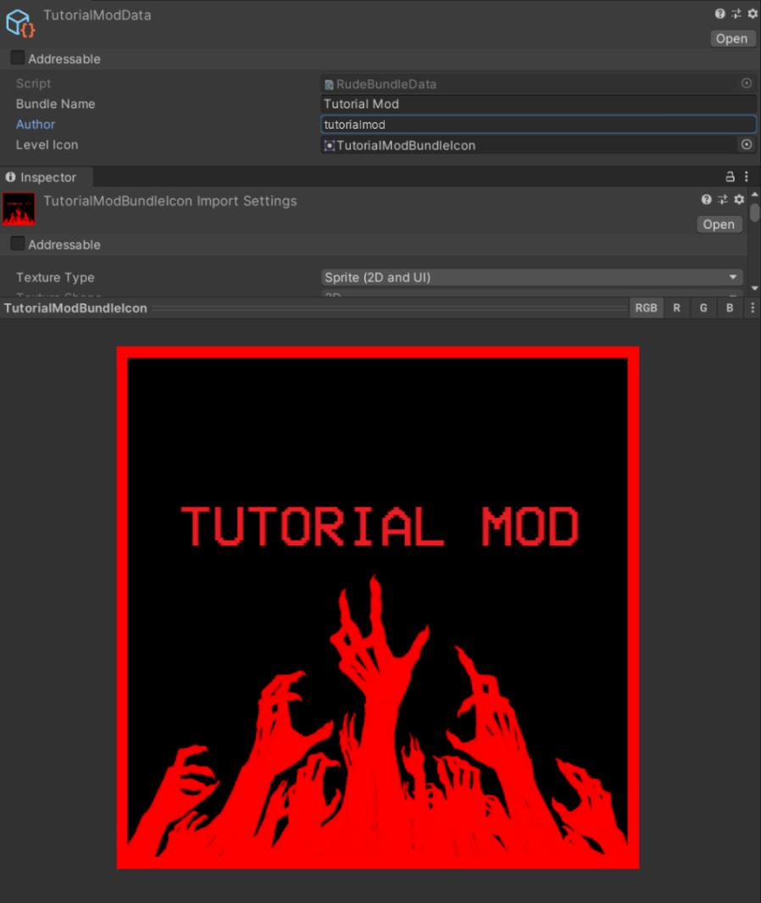
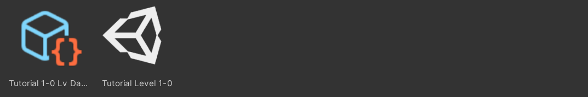
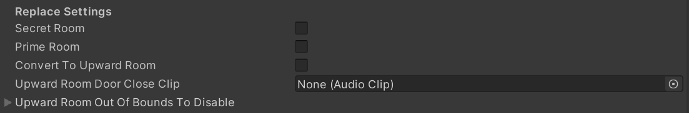
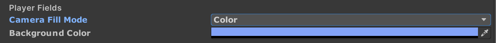
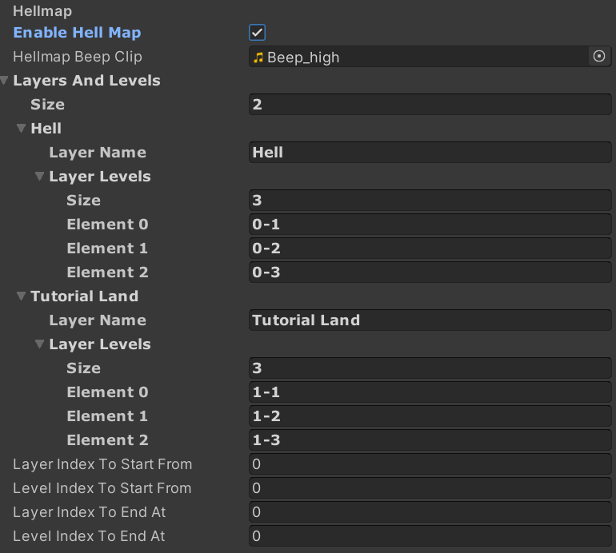

# Creating Levels

## Level Requirements
***Every level needs certain things to function and be able to be exported and played in the Angry Level Loader.***

### In Your Project

**For every level bundle...** *(either one or multiple levels)*
- `Rude Bundle Data`, used to store the following information about your level bundle:
    - `Bundle Name`, the name of your bundle, and the name that will be displayed in the level loader
    - `Bundle Author`, the person listed as being the creator of the level bundle
- `Level Bundle Icon` which is assigned in the `Rude Bundle Data` you create.

**For every level...**
- A Unity Scene, corresponding to your level, *this is where you will build your level*!
- `Rude Level Data`, used to store the following information about your level:
    - `Target Scene`, the scene this `Rude Level Data` asset is related to.
    - `Level Name`, simply put... the level's name. (*For example: 0-1: INTO THE FIRE*)
    - `Is Secret Level`, set to true if your level is a secret level. It disables the challenge panel and sets to spawn room to it's secret variant.
    - `Preffered Level Order`, used to order levels in the angry level loader, smaller numbers show up at the top. *This is useful to order levels if your level bundle contains multiple levels*.
    - `Level Preview Order`, the image preview for your level.
    - `Hide If Not Played`, hides your level from displaying in the Angry Level Loader, unless accessed through a secret pit. *Useful for secret levels*!
    - `Required Level Ids For Unlock`, the list of level's `Unique Identifer` required to be completed for your level to be unlocked.
    - `Level Challenge Enabled`, when enabled sets your level's challenge to the value contained in `Level Challenge Text`.
    - `Level Challenge Text`, your level's challenge text. This is only displayed if `Level Challenge Enabled` is set to `true`.
    - `Unique Identifer`, used internally for loading levels. 

> [!WARNING]
> Two levels cannot share the same `Unique Identifer`! 

---

### In Your Level's Scene

Every scene, has a couple requirements on what gameobjects must be in the scene for the level to properly function. These objects are listed below:

- [**EventSystem**](https://docs.unity3d.com/Packages/com.unity.ugui@2.0/manual/EventSystem.html) - Unity's Built In solution for input detection for UI; 
- **BeamDirectionSetter** - No actual clue what this does lmao. I don't think anyone knows... Ask Hakita?
- **Level Info** - Contains data about the current level. These values are listed below:
    - `Layer Name`: This object contains the text for the level name popup (*For example: PRELUDE///FIRST*). 
    - `Level Name`: The level's actual name (*For example: 0-1: INTO THE FIRE*).
    - `Sandbox Tools`: If set to `true` enable sandbox tools.
    - `Hide Stock HUD`: If set to `true` disable the stock HUD.

    - `Large Image`: Used to detect the level preview image in menu, but also used to detect which level player is in. 
    - `Large Text` : Used as the title for the stats tab (when you press tab)
    > **Note:** [Discord Rich Presence](https://discord.com/developers/docs/rich-presence/how-to) is configured based on these values!
    
- **StatsManager**: Contains values for your level's ranks (S-C): `maximum completion time`, `minimum kills` and `minimum style`.
    - **For example**: If the `maximum completion time` ranks are set to `[60, 90, 120, 150]`, *S-rank* requires max **60 seconds** and *A-rank* requires max **90 seconds**.
    - **MusicManager**: Contains the calm/battle/boss audio sources as children. 
        - **Calm Music**, plays when there are no active enemies.
        - **Battle Music**, plays when there are active enemies, but no boss enemies.
        - **Boss Music**, plays when tere are active boss enemies (*enemies with health-bars*).
- **OutOfBounds**: Kills enemies and teleports the player back to spawn. Can display whatever message you want.

> [!WARNING]
> This does not damage the player and should only be used as a fail-safe if the player out of bounds.

- **FirstRoom**: This room is where the player spawns. This room must have the default position of `(0, 0, 300)`. **You should NOT use the original prefab**. Instead, use the **rude's dummy prefab** which is replaced with the original one in the game. 

> [!NOTE]
> Several settings can be changed from here as well such as background color, skybox, music/title display on door open, as well as configuring your level's hellmap.

When creating a new level, it is required your scene contains these gameobjects. Think of them as the backbone of your level and without them your level can experience unintended side effects.

As a rule of thumb, leave all of these gameobjects unparented!

> [!TIP]
> Instead of manually creating or copying these objects, we suggest making a duplicate of the `essentials` scene located in `Assets/Custom/essentials.unity`. 

## **Setting Up Your Custom Level Bundle**
This tutorial will teach you how setup your custom level bundle and how to export and play your level in the Angry Level Loader!

`@eternalUnion` has created a video tutorial showcasing all of the steps below!

<iframe width="750" height="420" src="https://www.youtube.com/embed/6PHrCwGiavU?si=tGLh6nbe5I0zdtbR" title="YouTube video player" frameborder="0" allow="accelerometer; autoplay; clipboard-write; encrypted-media; gyroscope; picture-in-picture; web-share" allowfullscreen></iframe>

> [!PROTIP]
> Don't want to do it yourself?😴  ㅤㅤㅤㅤㅤㅤㅤㅤㅤ  ㅤㅤㅤㅤㅤㅤㅤㅤㅤ  ㅤㅤㅤㅤㅤㅤㅤㅤㅤ  ㅤㅤㅤㅤDownload a premade folder containing everything already made for you [here](drive.google.com). ㅤㅤㅤㅤㅤㅤㅤㅤㅤㅤㅤ *Hey!* *At least read the docs* 😉

### Creating Our Folder Structure *(Optional)*
Navigate to `Assets/Custom/` and create a new folder by pressing `🖱 Right Click` and navigating to `Create/Folder`. Name this folder the desired name of your mod. We will name ours "*TutorialMod*".

Inside of our new folder we will create this folder structure: 

> [!NOTE]
> Keep in mind all of this is optional and you can add or remove folders to meet your project's needs. This is simply the system I have developed while making levels.

*Now we can move onto setting up our level bundle!*

### Setting Up the Bundle
In our `TutorialMod` folder we will create a new `Rude Bundle Data` asset by pressing `🖱 Right Click` and navigating to `Create/Rude Bundle Data`.

Then fill out your created Bundle Data to match whatever you want.

We've configured our bundle to look like this:

> [!WARNING]
> Images imported to use in the `Rude Bundle Data` & `Rude Level Data` assets, must be imported as type `sprite`. Check your image's import settings!

### Setting Up The Level
Now that we have created our `Bundle Data` we can begin creating our first level. Navigate to `Assets/Custom/` in the project window and duplicate these two files: `essentials.unity` & `essentials.asset`.

> [!TIP]
> Scenes can be duplicated by pressing `⇧ Shift` + `D`!

Drag these files into the `TutorialMod` folder. 

Then, rename both files to match the name of the level you are creating. 

We will name the scene `Tutorial Level 1-0` and will name the ScriptableObject (*.asset*) to `Tutorial 1-0 Lv Data.

*If you have already set up a [folder structure](/Quick-Start/Creating%20Levels?id=creating-our-folder-structure-optional) you can move these files into the folder corresponding to this level.*

*(We're gonna move these files to `TutorialMod/Levels/Level One/`)*

### Configuring Our Level's Scene *(Some Finishing Touches)* 🧹✨

#### The FirstRoom Object
Inside our first room gameobject prefab, we can configure many settings for our level.

In the **`Replace Settings`** category we can choose to either convert our spawn room into either its prime or secret variants.

We can also convert our room into an upward room, but it doesn't make sense in our case.

> [!NOTE]
> Your room will change inside of the Ultrakill game itself. Don't worry if you hit any of the checkboxes and nothing happens in the editor!

In the **`Player Fields`** category allows us to change the level's skybox (which is key to making our levels look good).

**We can choose from the following options**:
- Skybox *(Recommended!)*
- Color *(Recommended!)*
- Solid Color
- Depth
- Nothing

In the **`Hellmap Category`** we can configurate our **spawn-room's hellmap**.

Set the `Enable Hellmap` field to `true` if you would like your level to have a hellmap when it starts.

To configure the hellmap use the arrays located under `Layers And Levels`. 

*The image above displays a premade made hellmap*.
> [!TIP]
> Be creative with your hellmaps! You don't have to set your hellmap up like in official Ultrakill levels. Do note the make `4` character limit for level names.

The bottom four fields are used to configure what positon your hellmap starts/stops at.

#### The StatsManager
The StatsManager gameobject houses all ranking data for your level. It contains many configurable fields to set up the ranking system for you level. These fields are listed below:

- **Debug Check Point** - DO NOT TOUCH, *Hakita stuff*.
- **Level Number** - DO NOT TOUCH, *Hakita stuff too*.
- **Timer** - DO NOT TOUCH, *some more Hakita stuff*.
- **Time Ranks** -  Four values, each the maximum time (*in seconds*) for each rank. 
- **Kill Ranks** - Four values, each the minimum amount of kills for each rank. 
- **Style Ranks Ranks** - Four values, each the minimum amount of style points for each rank. 

> [!NOTE]
> Ranks are ordered from top to bottom C (*at the top*) & S (*at the bottom*).

- **Secret Objects** - DO NOT TOUCH, *Hakita stuff*.

Everything else should already be pre-assigned and should not be modified as well.

#### Setting up music for our level (The Music Manager)
To set up music for our level we will be using the **Music Manager** a gameobject which should already be in your scene if you followed the previous steps correctly.

The **Music Manager** has `3` children, each an [audiosource](https://docs.unity3d.com/2019.4/Documentation/Manual/class-AudioSource.html) corresponding to each of the level's tracks:

- **Calm Music**, plays when there are no active enemies.
- **Battle Music**, plays when there are active enemies, but no boss enemies.
- **Boss Music**, plays when tere are active boss enemies (*enemies with health-bars*).

Import these 3 tracks of your choosing (*two if there are no boss enemies*), and import them into `TutorialMod/Sounds/Music/`.

Then select each of the indiviudal [audiosources](https://docs.unity3d.com/2019.4/Documentation/Manual/class-AudioSource.html) and assign their `AudioClip` field to the corresponding [audioclip](https://docs.unity3d.com/2019.4/Documentation/Manual/class-AudioClip.html).

**And Voila!** *You finished! In the next part you will learn how to export your level!*

### Exporting Your Level

#### Labling our Assets

To export our level we first have to create a new asset bundle lable. We can do this by selecting our `Rude Bundle Data` asset and clicking the `AssetBundle` text at the bottom of the inspector.

Click `New...`, and set the name of the label to your `Rude Bundle Data`'s `Bundle Name` in our case we will set the label name to `tutorialmod`.

Now that we properly created our label, we only need to label a few assets:
- All `Rude Level Data` assets, part of our level bundle.
- All [Scenes](https://docs.unity3d.com/2019.4/Documentation/Manual/CreatingScenes.html), part of our level bundle.
- All **image preview assets**, only the ones referenced in our `Rude Level Data` assets and in our `Rude Bundle Data` asset.
- Lastly, our `Rude Bundle data`.

Once this is complete we can export our level bundle.

#### Exporting our Level

Open the export window by navigating to `Window/Export Level`.

> [!TIP]
> We suggest docking your export window next to your inspector for easy access!

Set `Bundle to build` to the name of the label we created [here](/Quick-Start/Creating%20Levels#labling-our-assets).

Make sure `Analyze before build` is set to `true`.

**Finally, build your level!**

>[!PROTIP]
> If you recieve any errors in your console DON'T PANIC, try to resolve them, check [FAQ](FAQ.md), or ask in the [discord server](https://discord.com/channels/1121799211101458572/1123661339789897790).

---

*Guide Written by: eternalUnion*

*Adapted & Expanded by: LUKA*

