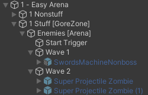
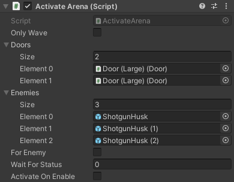
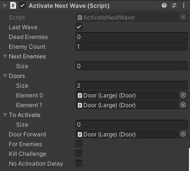
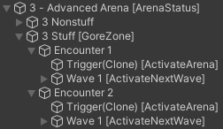

# Creating Arenas

---

It's not unreasonable to assume that a typical ULTRAKILL level will have enemies in it. This guide will detail how arenas work, in detail.

This guide will yield a similar result to the level following example video: [(View on YouTube)](https://www.youtube.com/watch?v=Ln_HK9uy2Yo)

<iframe width="700" height="450" src="https://www.youtube-nocookie.com/embed/Ln_HK9uy2Yo" title="YouTube video player" frameborder="0" allow="accelerometer; autoplay; clipboard-write; encrypted-media; gyroscope; picture-in-picture; web-share" allowfullscreen></iframe>

## Arena Setup

**You should have a room structure like the following:** (see: [Checkpoints](checkpoints.md))

**Create a hierarchy like the following:**

- `2 - Manual Arena`
- - `2 Nonstuff`
- - - Your level geometry and lights will go here...
- - `2 Stuff` (this should have a `GoreZone` on it)
- - - `Enemies`

This time, `Enemies` is simply a blank GameObject for organization.

**Under `Enemies`, you should have a trigger box with the `ActivateArena` component on it.** This will be your arena start trigger. Don't worry about the settings for now.

**Now, create as many waves as you want, each with `ActivateNextWave` on it. Set the *Enemy Count* as per the previous example.**

Now comes the somewhat tedious part: **For every wave, make the *previous* wave spawn the current wave's enemies.** For example, add Wave 2's enemies to Wave 1's *Next Enemies* list, and Wave 1's to the Start Trigger's.

**List the doors surrounding your Arena both in the Start Trigger's and the final Wave's *Doors* arrays.**

**In the final wave, check the *Last Wave* box and (optionally) set the *Door Forward*.**

>[!WARNING]
>Enemies spawn immediately when activated by any means. You must deactivate the enemies by hand before exporting, otherwise they will spawn immediately when the room loads.
>
>*You can also intentionally leave enemies activated*. *For example, `P-2` does this with idols, which are always present and don't have a spawn effect*.

When you are finished, your hierarchy should look something like this:

Your start trigger should look something like this:

And the final wave should look something like this:

## ArenaStatus

Sometimes, you want multiple arenas in the same room. Perhaps you're creating a non-linear level, and want a different encounter on the return trip. In such cases, `ArenaStatus` will help.

In this example, we're going to have two encounters in the same room: one on first entering the room, and another activated by a condition.

**Create a hierarchy like the following:**

- `3 - Advanced Arena`
- - `3 Nonstuff`
- - - Your level geometry and lights will go here...
- - `3 Stuff` (this should have a `GoreZone` on it)
- - - `Encounter 1`
- - - `Encounter 2`

**Create both encounters using the Manual Setup detailed above.**

Encounter 1 will run normally on entering the room, and doesn't need any further changes.

To create an alternative encounter that activates on a condition, **first add an `ArenaStatus` component to the top-level Room Object, `3 - Advanced Arena` in this case.**

**Open Encounter 2's Start Trigger and set *Wait For Status* to 1.**

Now, create something that will change the `ArenaStatus`. Skull Pedestals have a *Arena Statuses* field, which is what is used in the example.

And... that's it! Now encounter 1 should run when first entering the room, and then encounter 2 should run upon returning to the room after triggering something (e.g. a skull placement).

You should have a hierarchy like the following:

## Miscellaneous tips

- `DeathMarker` is a component that allows you to bump an `ActivateNextWave`'s enemy count, same as an enemy death would. Simply add it to a GameObject, then activate the GameObject. This is useful for more complicated arena setups where an enemy survives across waves, for instance.

- You can have multiple `ActivateNextWaves` on the same object, which can be useful if you want to trigger something when a certain number of enemies die and another thing when more enemies die.

- `ActivateNextWave` has a *To Activate* field to activate objects once the wave ends, useful for e.g. FinalRoom's `FinalDoorOpener`.

## Useful Resources

* [Arena Creation Tutorial (Simple)](https://www.youtube.com/watch?v=Ln_HK9uy2Yo)
* [Arena Creation Tutorial (Advanced)](https://www.youtube.com/watch?v=7ZIXvQ0wgmU)
* [Arena Creation (Tundra Docs)](https://deploy-preview-7--tundra-docs.netlify.app/guides/arenas/)

---

*Original Guide From: [The Tundra Documentation](https://deploy-preview-7--tundra-docs.netlify.app/guides/arenas)*

*Adapted & Expanded by: LUKA*
