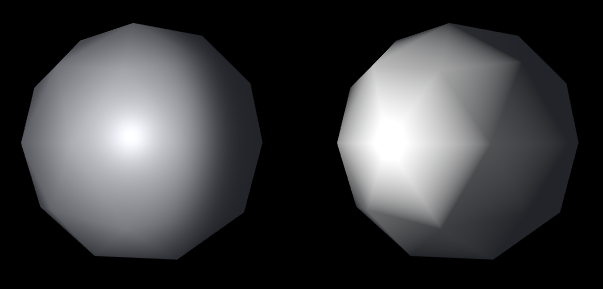
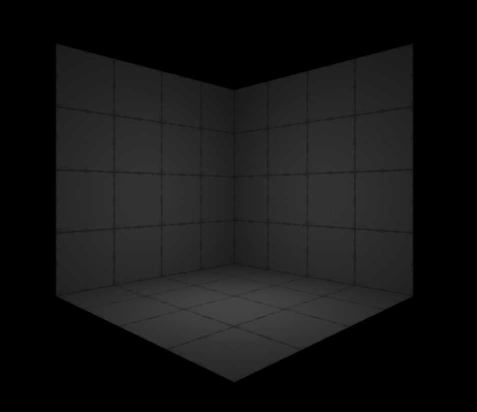
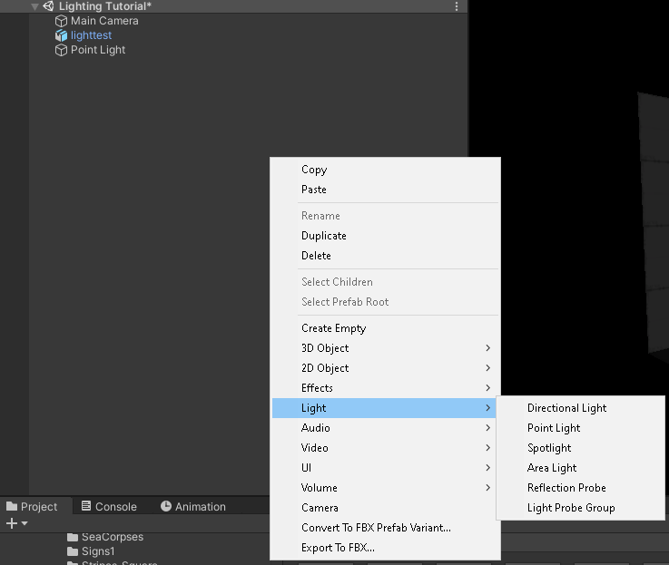
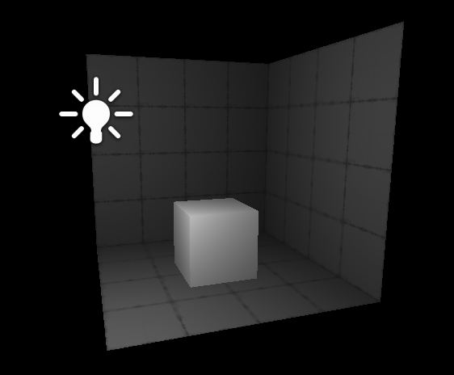
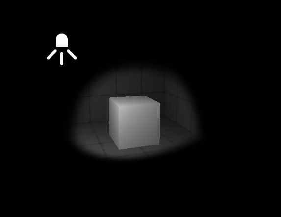
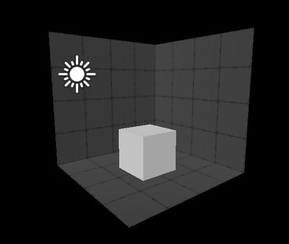
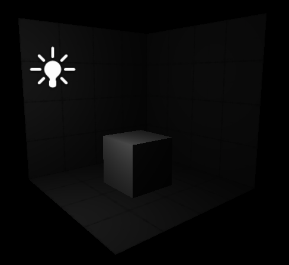
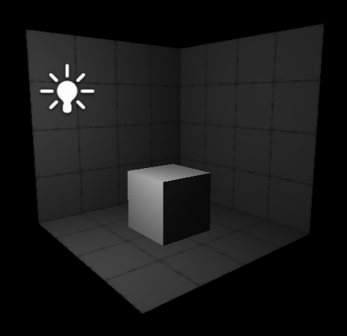
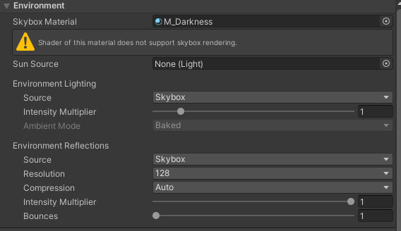
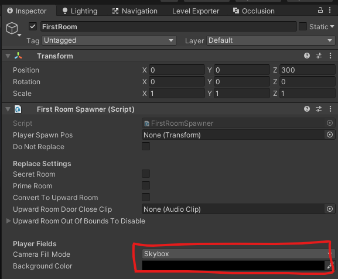

# Lighting 101 (Beginner Tutorial)

This will teach you the basics to [lighting](https://docs.unity3d.com/2019.4/Documentation/Manual/LightingOverview.html) your Ultrakill levels!

## Introduction

*Believe it or not...* lighting is a very important part of level design. It can help set a tone whether that be a happy sunny sky, or a spooky dimly light tunnel.

Lighting can also help you be more effiecent with your detailing proccess, allowing you to mask part of your level in darkness.

A couple things before we begin:
- Every object must have a material, which is well... its material
    - Every material's base is a [`shader`](https://docs.unity3d.com/2019.4/Documentation/Manual/Shaders.html), which in Ultrakill's case are custom-made to help convey the retro theme.
- Ultrakill uses [vertex-lit shading](https://docs.unity3d.com/Manual/shader-NormalVertexLit.html) which basically means the more vertices your object has the *smoother* your lighting will be.
    - However this comes at a cost... the more vertices an object has and therefore more faces, the more performace-heavy it will be
- Ultrakill lighting is slightly different in-game, to see how your lights actually look [build your level](/Quick-Start/Creating%20Levels#exporting-your-level) and test it!
*Vertex-Lit Lighting (Right):*

## Scene Lighting Toggle
The scene lighting toggle; indicated by the button marked in the image below, simply toggles between two lighting modes.

- **Scene Lighting** `Enabled`: Is roughly what your level would look when built and tested in Ultrakill.

- **Scene Lighting** `Disabled`: Shows your level without any lights on and with even lighting, great while creating levels that are dimly lit.

## Basic Lighting

### Adding a Light

To add a light to your scene, simply `🖱 Right Click` in your hierarchy, hover on `Light`, and select the type you want. 

---

### Light Types

Unity has `4` different types of light built in, all with different effects and purposes:

---

### The Point Light

The **Point Light**, lights everything around it uniformly in a spherical shape.

This is the most commonly used type of light for levels, as it is extremely versatile.

---

### The Spot Light
Lights objects in a large conical beam, does essentially the same thing as a real life spotlight. 

---

### The Directional Light

Acts as a Sun, casting uniform light from a specific direction.

Useful for simulating a strong light coming from one direction, or multiple can be used to fully light a level.

---

### The Area Light

Emits even light from a rectangular-shaped area. 

Similar to sun-light coming from a window.

> [!DANGER]
> Area Lights require [baking](https://docs.unity3d.com/2019.4/Documentation/Manual/LightMode-Baked.html), which is not supported by Ultrakill's lighting system, making this type of light unusable!

---

### Light Settings
With a `light` selected, the inspector will show these settings:

*(These may vary slightly for different lights, which I will cover shortly)*

- **Type**: Sets the light-type to: `Point/Spot/Directional/Area`.
- **Range**: Controls how far light from the source will be visible.
    - **Point light** with a range of `10`:

    

    - **Point light** with a range of `25`:

    
- **Color**: Sets the color of the light.
- **Mode**: Sets the rendering mode of the light (**Keep this set to realtime**).
- **Intensity**: Controls the actual brightness of the light.
- **Indirect Multiplier**: Used for [baked lighting](https://docs.unity3d.com/2019.4/Documentation/Manual/LightMode-Baked.html), **not supported by ULTRAKILL**!
- **Shadow Type**: Sets the type of shadows cast by the light (**Set this to No Shadows**).
- **Cookie**: Can be used to create advanced lighting effects, such as masking parts of a light (*Also ignore this one for now!*)
- **Draw Halo**: If enabled, the light will render a spherical halo of light around itself.
- **Flare**: Makes the light emit lens flares.
- **Render Mode**: Sets how important the lights in the scene are. 
    - If lights are marked `Not Important`, they may disappear to save performance (*See the warning below*).
    - If lights are marked `Important`, lights should not have this issue, but keep in mind they are very **performance heavy**, so don't use too many of these.
- **Culling Mask**: Sets what [layers](https://docs.unity3d.com/2019.4/Documentation/Manual/Layers.html) the light affects. Change this if you want a light to only illuminate certain things, otherwise keep it as is.

> [!WARNING]
> Be careful when placing many lights in your level as *Ultrakill will only render a maximum of 8 lights on an object*. Having more lights render can cause lights to flicker as the renderer does not know which of these 8 lights to give priorty.
>
> To bypass this, consider reading the [Optimization Tutorial](/Tutorials/Intermediate/Optimization%20101.md) to learn how to dynamically unload & load parts of your level!

---

## Scene Lighting

Having good scene lighting is very important to having a properly and creatively lit level.

Keep in mind scene lighting should be used as a **base** and should be supplemented with others lights too!

### The Lighting Tab

The lighting tab can be accessed via: `Window > Rendering > Lighting Settings`.

Since this tab has a lot of information, I'm only going to cover what is relevant to ULTRAKILL.

---

### Enviroment Tab

This tab is used for setting your level's skybox, which then can be used to light your level.

- **Skybox Material**: Sets the skybox of your level.
    - Choosing a skybox here will apply it to the level, and also add uniform lighting to your level with the overall colour of your skybox:

> [!TIP]
> To use a skybox and not a solid color, `Camera Fill Mode` must be set to `Skybox` in the `First Room` object.
>
> 

- **Intensity Multiplier**: Sets how bright the lighting from your skybox is. *If you don't want the skybox to light the level, set this to `0`*. 

---

## Conclusion

Now you should be able to begin lighting your levels in more creative ways using all the tools Unity provides.

Before you go... here are some final tips!
- Make sure to combine regular lighting with skybox lighting!
    - Skybox lighting is perfect to use for a base, but looks very bland by itself.
- Don't overlight your level!
    - Make sure the light level is as bright as you want it, but make sure to have some variation in brightness to give the level some depth.

- Experiment with different colours!
    - Using a completely white light is rarely a good idea. Tinting the light even very slightly can give your level a lot of atmosphere.
    - *For example*: Lights with a slight orange hue make the level feel warm, *similar to prelude*.
    - Lights with a slight light blue hue feel very synthetic and industrial, *perfect for fluorescent lighting*.
- **Less is more**!
    - Using less lights than you'd imagine is often a very good way to make great looking lighting, while saving on performance. 

## Useful Resources

* [Lighting in Unity (Unity Docs)](/https://docs.unity3d.com/2019.4/Documentation/Manual/LightingOverview.html)
* [Shader (Unity Docs)](https://docs.unity3d.com/2019.4/Documentation/Manual/Shaders.html)
* [Vertix-Lit Lighting (Unity Docs)](https://docs.unity3d.com/Manual/shader-NormalVertexLit.html)
* [Optimization 101 (Rude Docs)](/Tutorials//Intermediate/Optimization%20101.md)  

---

*Guide Written by: __tris*

*Adapted & Expanded by: LUKA*

