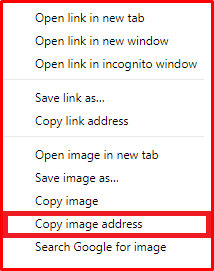
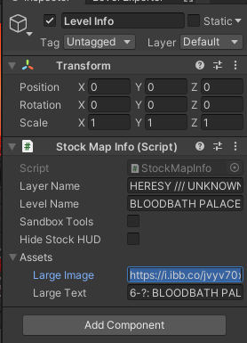

# Setting up Discord Integration (Intermediate Tutorial)
This tutorial will show you how to set up **discord integration** for your level, so when someone is playing your level it can display in discord.

## Setting up Integration for your Image

### Step 1: Getting your image
Create or find the image of your level you want to display for your Discord Integration.

> [!WARNING]
> While the image you choose can be of any size, we suggest selecting an image that has a `4:3` aspect ratio.

### Step 2: Uploading your image 
Go to any site that you can upload images (**and host them!**) we use `https://imgbb.com/` in this tutorial. 

Then upload your image and then right click the image and click on the button that says `Copy image address`. 

### Step 3: Getting the image into the level info
Return to Unity, find and select the `Level Info`.

Paste the link you have copied into the `Large Image` field.

---

## Setting up Integration for your Level
To setup the text the Discord Integration should display, set your level's name in the `Large Text` field.

>[!PROTIP]
> Like always... If you recieve any errors in your console DON'T PANIC, try to resolve them, check [FAQ](FAQ.md), or ask in the [discord server](https://discord.com/channels/1121799211101458572/1123661339789897790).

---

*Guide Written by: __megga*

*Adapted & Expanded by: LUKA*

